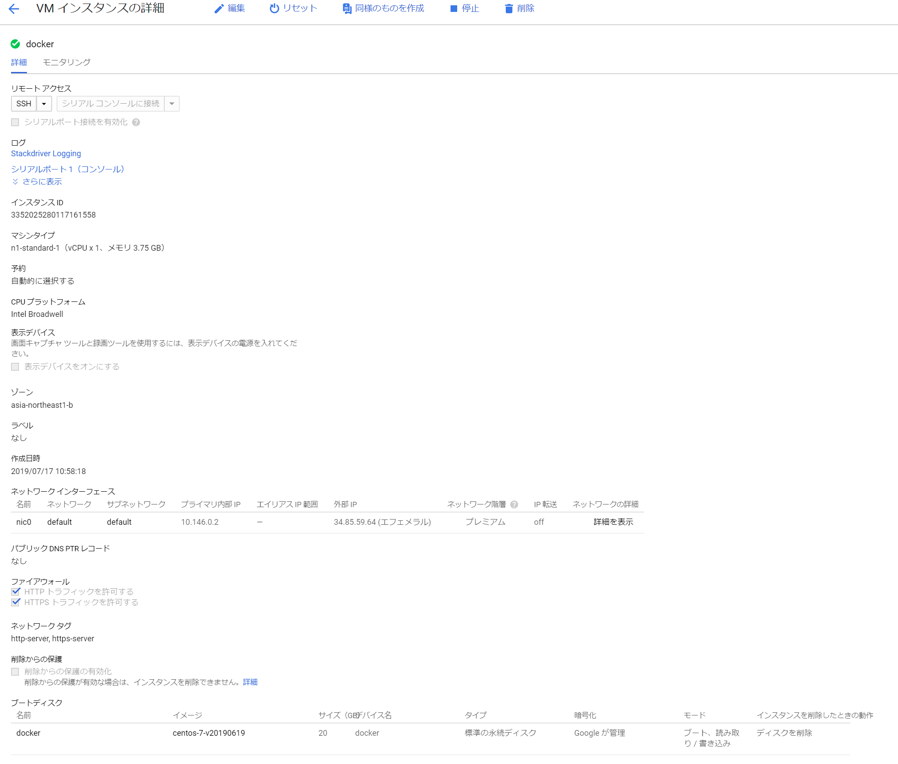

# Docker編

## 準備 - 仮想マシン作成
1. VMインスタンス作成



2. ファイアウォール作成  
全トラフィックを許可するものを作成

3. rootユーザパスワード設定

## Docker操作

```sh
# 必要なパッケージをインストール
yum install -y yum-utils device-mapper-persistence-data lvm2
# リポジトリを追加
yum-config-manager --add-repo
# Docker Community Editionをインストール
yum install -y docker-ce

# コンテナの自動起動・開始
systemctl enable docker.service
systemctil start docker.service

# コンテナの情報を表示
docker version
docker info

# DockerHubからイメージをプル
docker serach linaction
docker image pull -a linaction/centos
docker image ls

# Dockerイメージを実行
docker container run -it --name centos01 linaction/centos:centos6 /bin/bash
```

#### デタッチ
コンテナから出ること。  
`Ctrl + P + Q`

#### アタッチ
コンテナ内に入ること。  
`docker container attach <CONTAINER_NAME>`

#### attachとexecの違い
execではPID=1にデフォルトで/bin/bashを起動し、その上で初回起動プロセスを実行。  
そのためexecではexitしても終了しないが、attachの場合にexitすると終了する。
```
[root@ced12dfb0518 /]# ps -ef
UID        PID  PPID  C STIME TTY          TIME CMD
root         1     0  0 02:18 pts/0    00:00:00 /bin/bash
root        12     0  0 02:23 pts/1    00:00:00 /bin/bash
root        23    12  0 02:23 pts/1    00:00:00 ps -ef
```

#### Dockerfileからイメージをビルド
```sh
docker image build -t linaction/wordpress:ver1.0 ~/build_wordpress
```

`-t`オプションで名前をつけることができる。形式は`[イメージ名:タグ名]`。

#### Dockerイメージをコミット/プッシュ（デモ）
```sh
# コンテナを保存する
docker container commit wordpress01 linaction/wordpress:ver1.0
# Docker Hubにログイン
docker login
# Docker Hubにログインにコンテナイメージをプッシュ
docker image push linaction/wordpress
# リポジトリを確認
docker search linaction
```

#### Dockerお片付け
**コンテナの一括削除（停止中のもの）**
```sh
docker container rm `docker container ls -a -q`
```

**イメージの一括削除**
```sh
docker image rm `docker image ls -a -q`
```

ちなみに...  
`systemctil stop　docker.service`でDockerを停止して`/var/lib/docker`を全削除して、再開すればクリーンな状態で実行しなおせる。
