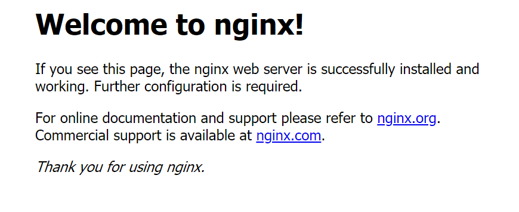

## Dockerを即時使えるEC2インスタンスを起動する

### 概要
CloudFormationテンプレートを利用して、Dockerを即時使用可能な環境を作成します。

CloudFormationを利用することには、
+ 完全な再現性を持つデモ環境を構築することができる
+ 複雑な手順を設ける必要がない
+ 環境のクリーンはスタックの削除をするだけでよい

というメリットがあります。

**DockerOnEc2.yaml**
```yaml
###############################################
# 概要
# Dockerをインストール済みのEC2とVPC及びSSMアクセスするためのロール等を作成します
# 東京リージョンを想定しています
###############################################

AWSTemplateFormatVersion: '2010-09-09'

###############################################
# Parameters
###############################################
Parameters:
  ProjectName:
    Type: String
    Default: DockerDemo

  # EC2インスタンス用のキーペアはEC2マネジメントコンソールで事前に作成し、キーペア名を入力してください
  EC2KeyPair:
    Type: AWS::EC2::KeyPair::KeyName

###############################################
# Resources
###############################################
Resources:
  Vpc:
    Type: AWS::EC2::VPC
    Properties:
      CidrBlock: 10.0.0.0/25
      EnableDnsSupport: 'true'
      EnableDnsHostnames: 'true'
      InstanceTenancy: default
      Tags:
        - Key: Name
          Value: !Sub ${ProjectName}-vpc

  InternetGateway:
    Type: AWS::EC2::InternetGateway
    Properties:
      Tags:
        - Key: Name
          Value: !Sub ${ProjectName}-igw

  IgwAttachVpc:
    Type: AWS::EC2::VPCGatewayAttachment
    Properties:
      InternetGatewayId: !Ref InternetGateway
      VpcId: !Ref Vpc

  PublicSubnet:
    Type: AWS::EC2::Subnet
    Properties:
      VpcId: !Ref Vpc
      AvailabilityZone: 'ap-northeast-1a'
      CidrBlock: 10.0.0.0/27
      MapPublicIpOnLaunch: 'true'
      Tags:
        - Key: Name
          Value: !Sub ${ProjectName}-public-subnet

  PublicRouteTable:
    Type: AWS::EC2::RouteTable
    Properties:
      VpcId: !Ref Vpc
      Tags:
        - Key: Name
          Value: !Sub ${ProjectName}-public-rtb

  RouteAddInternet:
    Type: AWS::EC2::Route
    Properties:
      DestinationCidrBlock: 0.0.0.0/0
      GatewayId: !Ref InternetGateway
      RouteTableId: !Ref PublicRouteTable

  AssociatePublicSubnet1ToPublicRouteTable:
    Type: AWS::EC2::SubnetRouteTableAssociation
    Properties:
      RouteTableId: !Ref PublicRouteTable
      SubnetId: !Ref PublicSubnet

  Ec2Securitygroup:
    Type: AWS::EC2::SecurityGroup
    Properties:
      GroupName: !Sub ${ProjectName}-ec2-sg
      GroupDescription: !Sub ${ProjectName}-ec2-sg
      Tags:
        - Key: Name
          Value: !Sub ${ProjectName}-ec2-sg
      VpcId: !Ref Vpc
      SecurityGroupIngress:
      - IpProtocol: tcp
        FromPort: '80'
        ToPort: '80'
        CidrIp: '0.0.0.0/0'

  Ec2onDocker:
    Type: AWS::EC2::Instance
    Properties:
      AvailabilityZone: ap-northeast-1a
      ImageId: ami-0d7ed3ddb85b521a6
      InstanceType: t2.micro
      KeyName: !Ref EC2KeyPair
      BlockDeviceMappings:
        - DeviceName: /dev/xvda
          Ebs:
            VolumeType: gp2
            VolumeSize: 10
      SecurityGroupIds:
        - !Ref Ec2Securitygroup
      SubnetId: !Ref PublicSubnet
      Tags:
        - Key: Name
          Value: !Sub ${ProjectName}-ec2
      IamInstanceProfile: !Ref Ec2IAMInstanceProfile
      UserData:
        Fn::Base64: |
          #!/bin/bash
          yum update -y
          yum install -y docker
          systemctl enable docker
          service docker start

  Ec2RoleForSSM:
    Type: AWS::IAM::Role
    Properties:
      AssumeRolePolicyDocument:
        Statement:
          -
            Effect: "Allow"
            Principal:
              Service:
                - "ec2.amazonaws.com"
            Action:
              - "sts:AssumeRole"
      Path: "/"
      ManagedPolicyArns:
        - arn:aws:iam::aws:policy/service-role/AmazonEC2RoleforSSM

  Ec2IAMInstanceProfile:
    Type: AWS::IAM::InstanceProfile
    Properties:
      Path: "/"
      Roles:
        - !Ref Ec2RoleForSSM

```

### Dockerの動作確認
Systems ManagerのSession Managerにてインスタンスとのセッションを開始し、以下のようにコマンドを実行します。

```sh
# ルートユーザに変更
sudo su -

# 1. Dockerのバージョンを確認
docker --version

# 2. Docker Hubでnginxを検索
docker search nginx

# nginxのlatestイメージをpull
docker pull nginx

# 3. 現在保持しているDockerイメージを表示
docker image ls

# nginxをホストport80/コンテナport80のバインドで実行
docker run -d --name example-nginx -p 80:80 nginx:latest

# 4. 実行中のdockerプロセスを表示
docker container ps
```

#### 1. Dockerのバージョンを確認結果例
```
[root@ip-10-0-0-23 ~]# docker --version
Docker version 18.06.1-ce, build e68fc7a215d7133c34aa18e3b72b4a21fd0c6136
```

#### 2. Docker Hubでnginxを検索結果例
```
[root@ip-10-0-0-23 ~]# docker search nginx
NAME                              DESCRIPTION                                     STARS               OFFICIAL            AUTOMATED
nginx                             Official build of Nginx.                        11727               [OK]
jwilder/nginx-proxy               Automated Nginx reverse proxy for docker con…   1628                                    [OK]
richarvey/nginx-php-fpm           Container running Nginx + PHP-FPM capable of…   728                                     [OK]
linuxserver/nginx                 An Nginx container, brought to you by LinuxS…   70
bitnami/nginx                     Bitnami nginx Docker Image                      69                                      [OK]
tiangolo/nginx-rtmp               Docker image with Nginx using the nginx-rtmp…   49                                      [OK]
nginx/nginx-ingress               NGINX Ingress Controller for Kubernetes         20
nginxdemos/hello                  NGINX webserver that serves a simple page co…   18                                      [OK]
jlesage/nginx-proxy-manager       Docker container for Nginx Proxy Manager        17                                      [OK]
schmunk42/nginx-redirect          A very simple container to redirect HTTP tra…   17                                      [OK]
crunchgeek/nginx-pagespeed        Nginx with PageSpeed + GEO IP + VTS + more_s…   13
blacklabelops/nginx               Dockerized Nginx Reverse Proxy Server.          12                                      [OK]
centos/nginx-18-centos7           Platform for running nginx 1.8 or building n…   11
centos/nginx-112-centos7          Platform for running nginx 1.12 or building …   9
nginxinc/nginx-unprivileged       Unprivileged NGINX Dockerfiles                  8
webdevops/nginx                   Nginx container                                 8                                       [OK]
```

#### 3. 現在保持しているDockerイメージを表示例
```
root@ip-10-0-0-23 ~]# docker image ls
REPOSITORY          TAG                 IMAGE ID            CREATED             SIZE
nginx               latest              98ebf73aba75        4 days ago          109MB
```

#### 4. 実行中のdockerプロセスを表示例
```
[root@ip-10-0-0-23 ~]# docker container ps
CONTAINER ID        IMAGE               COMMAND                  CREATED             STATUS              PORTS                NAMES
3473baf7e8e0        nginx:latest        "nginx -g 'daemon of…"   8 minutes ago       Up 8 minutes        0.0.0.0:80->80/tcp   example-nginx
```

#### `http://<EC2インスタンスのパブリックIPv4アドレス>:80`にアクセスした結果

