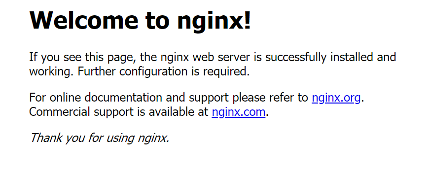

## Dockerの基本的な操作を試す

### Dockerイメージを取得して実行する
Systems ManagerのSession Managerにてインスタンスとのセッションを開始し、以下のようにコマンドを実行します。

```sh
# ルートユーザに変更
sudo su -

# 1. Dockerのバージョンを確認
docker --version

# 2. Docker Hubでnginxを検索
docker search nginx

# nginxのlatestイメージをpull
docker pull nginx

# 3. 現在保持しているDockerイメージを表示
docker image ls

# nginxをホストport80/コンテナport80のバインドで実行
docker run -d --name example-nginx -p 80:80 nginx:latest

# 4. 実行中のdockerプロセスを表示
docker container ps
```

#### 1. Dockerのバージョンを確認した結果の例
```
[root@ip-10-0-0-23 ~]# docker --version
Docker version 18.06.1-ce, build e68fc7a215d7133c34aa18e3b72b4a21fd0c6136
```

#### 2. Docker Hubでnginxを検索した結果の例
```
[root@ip-10-0-0-23 ~]# docker search nginx
NAME                              DESCRIPTION                                     STARS               OFFICIAL            AUTOMATED
nginx                             Official build of Nginx.                        11727               [OK]
jwilder/nginx-proxy               Automated Nginx reverse proxy for docker con…   1628                                    [OK]
richarvey/nginx-php-fpm           Container running Nginx + PHP-FPM capable of…   728                                     [OK]
linuxserver/nginx                 An Nginx container, brought to you by LinuxS…   70
bitnami/nginx                     Bitnami nginx Docker Image                      69                                      [OK]
tiangolo/nginx-rtmp               Docker image with Nginx using the nginx-rtmp…   49                                      [OK]
nginx/nginx-ingress               NGINX Ingress Controller for Kubernetes         20
nginxdemos/hello                  NGINX webserver that serves a simple page co…   18                                      [OK]
jlesage/nginx-proxy-manager       Docker container for Nginx Proxy Manager        17                                      [OK]
schmunk42/nginx-redirect          A very simple container to redirect HTTP tra…   17                                      [OK]
crunchgeek/nginx-pagespeed        Nginx with PageSpeed + GEO IP + VTS + more_s…   13
blacklabelops/nginx               Dockerized Nginx Reverse Proxy Server.          12                                      [OK]
centos/nginx-18-centos7           Platform for running nginx 1.8 or building n…   11
centos/nginx-112-centos7          Platform for running nginx 1.12 or building …   9
nginxinc/nginx-unprivileged       Unprivileged NGINX Dockerfiles                  8
webdevops/nginx                   Nginx container                                 8                                       [OK]
```

#### 3. 現在保持しているDockerイメージを表示した結果の例
```
root@ip-10-0-0-23 ~]# docker image ls
REPOSITORY          TAG                 IMAGE ID            CREATED             SIZE
nginx               latest              98ebf73aba75        4 days ago          109MB
```

#### 4. 実行中のdockerプロセスを表示した結果の例
```
[root@ip-10-0-0-23 ~]# docker container ps
CONTAINER ID        IMAGE               COMMAND                  CREATED             STATUS              PORTS                NAMES
3473baf7e8e0        nginx:latest        "nginx -g 'daemon of…"   8 minutes ago       Up 8 minutes        0.0.0.0:80->80/tcp   example-nginx
```

#### `http://<EC2インスタンスのパブリックIPv4アドレス>:80`にアクセスした結果


### DockerfileでVue開発環境を立ち上げる

#### Dockerfile
```Dockerfile
# ベースイメージを取得
FROM node:8.11.3-alpine

# カレントディレクトリを指定
WORKDIR /app

# vue-cliのインストールを実行
RUN apk update && \
    npm install -g npm vue-cli

# 環境変数を追加
ENV HOST=0.0.0.0

# コンテナのポート8080を公開
EXPOSE 8080

CMD ["/bin/sh"]
```

#### Dockerfileからイメージを作成し、コンテナを実行してみる
Systems ManagerのSession Managerにてインスタンスとのセッションを開始し、以下のようにコマンドを実行します。

```sh
sudo su -

# Dockerfileを作成する
vi Dockerfile

# イメージをビルドする
docker image build -t vue_dev:1.0 .

# イメージが作成できたことを確認
docker image ls

mkdir app
cd app

# ホストの80番ポートとコンテナの8080番ポートをバインド
# ホスト側のカレントディレクトリにコンテナの/appディレクトリをマウント
docker run -p 80:8080 -v `pwd`:/app --name vue_app -it -d vue_dev:1.0

# コンテナ内に入ってみる
docekr exec -it vue_app sh

# vueのプロジェクトを初期化してサーバを起動
vue init webpack
npm run dev
```

+ コンテナを終了せずにホストに戻るには`Ctrl + P + Q`を使う
+ ホスト側のファイルに修正を加えると、コンテナ側のファイルにも変更が反映される。逆もまたしかり。
